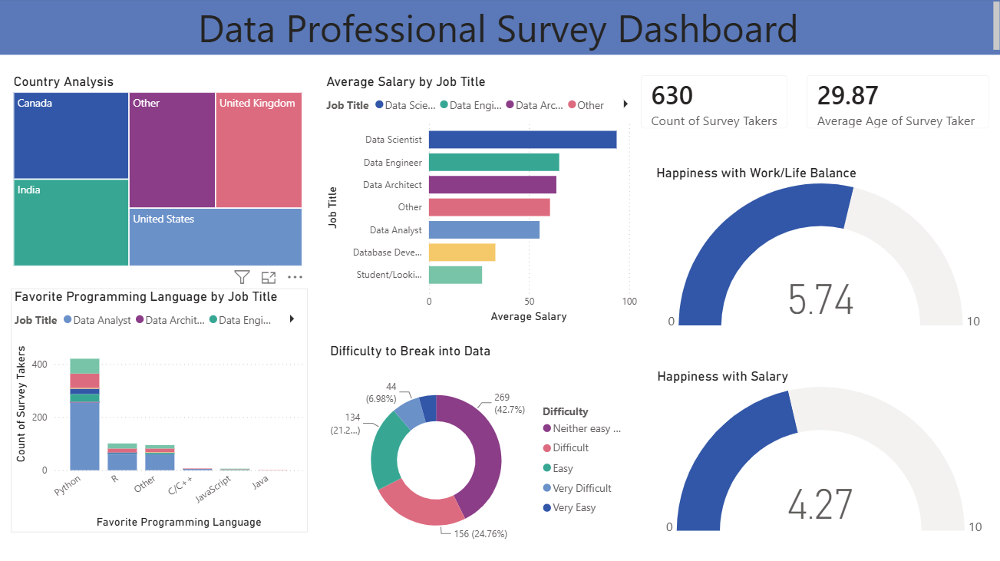

# 📊 Data Professional Survey Analysis (Power BI)

## Overview

This project is an interactive Power BI dashboard built using survey data from data professionals. It provides insights into salary trends, programming language preferences, job roles, work-life balance, and career satisfaction through interactive visualizations.

## Dashboard Preview

## Key Insights

- Analyzed responses from 630 survey participants from an already available survey dataset.
- Visualized country-wise distribution of survey respondents.
- Explored favorite programming languages by job title.
- Compared average salaries across different data-related job roles.
- Analyzed how difficult respondents found it to enter the data industry.
- Displayed KPIs such as Count of Survey Takers, Average Age, Work-Life Balance Rating, and Salary Satisfaction Rating.

## Visualizations

- Treemap
- Stacked column chart
- Stacked bar chart
- Donut chart
- Cards
- Gauges

## Tools & Technologies

- Microsoft Power BI
- Power Query
- DAX
- Microsoft Excel

## Skills Demonstrated

- Data Cleaning
- Data Transformation
- Data Visualization
- Dashboard Design
- Business Intelligence
- KPI Reporting
- DAX Measures
- Power Query
